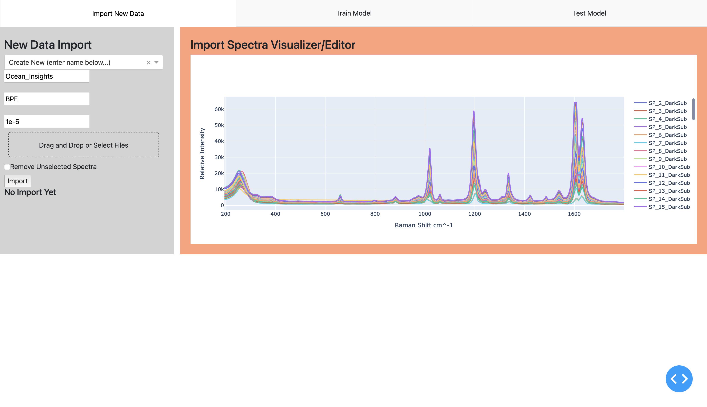
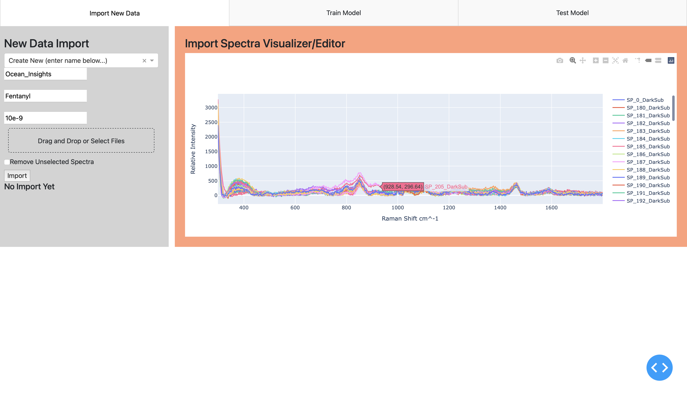
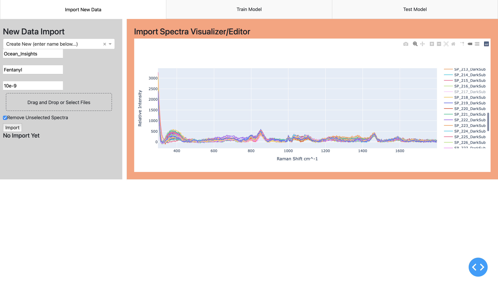
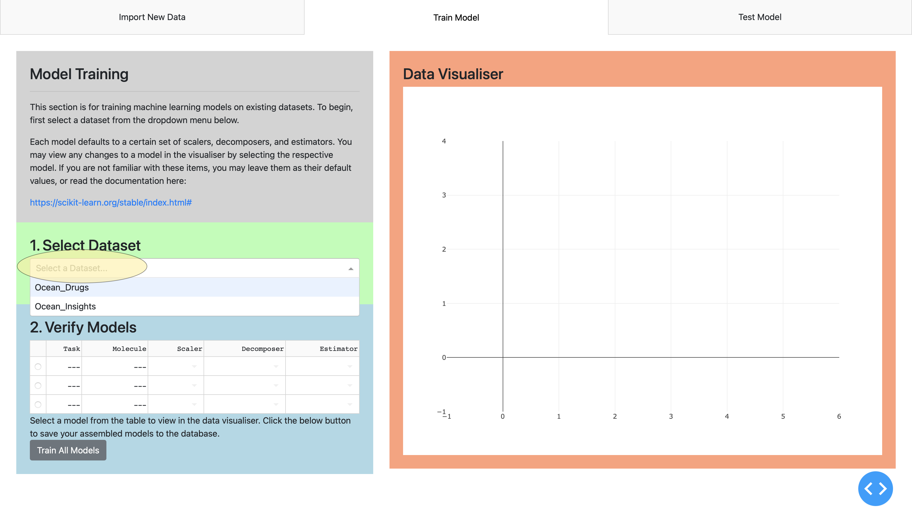
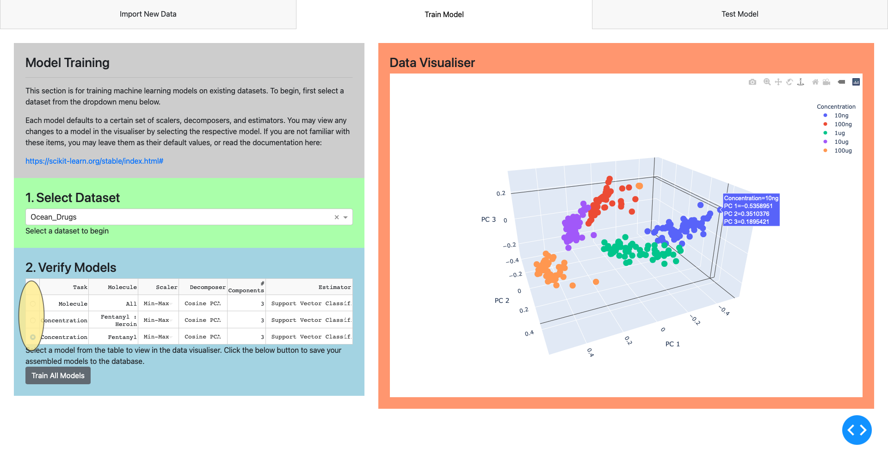
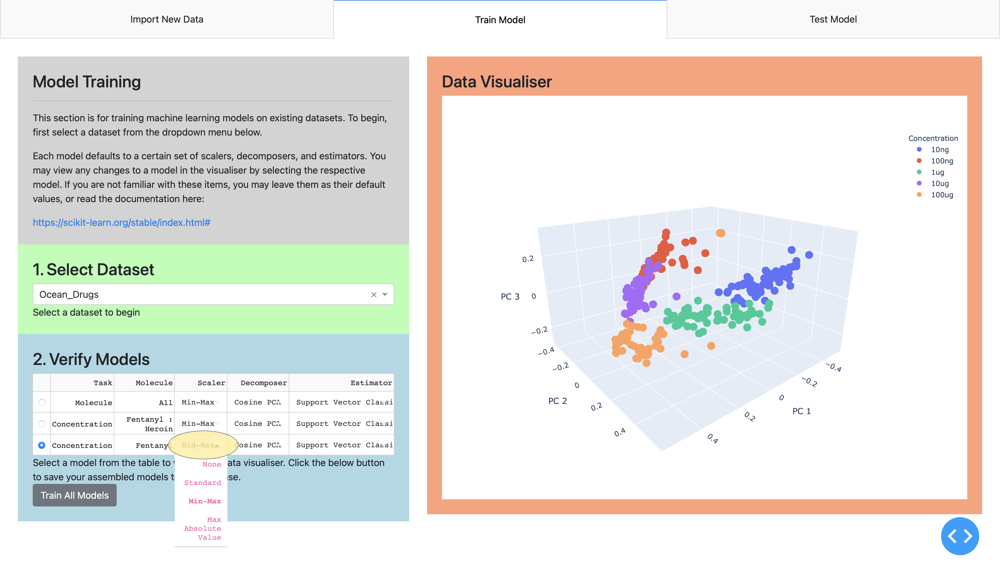
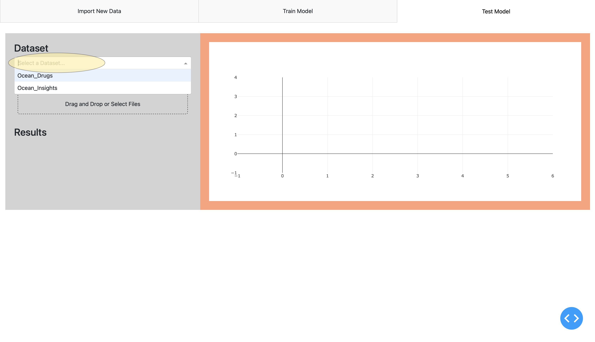
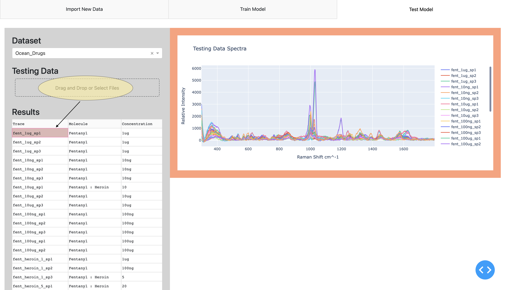

# sers_analysis_app

## Table of contents
+ [General info](#general-info)
+ [Setup](#setup)
+ [User Guide](#user-guide)

## General info
This project is for EE 494 - Senior Design at the University at Buffalo. Consisting of efforts from three students to create 
an expandable and simple user interface to facilitate SERS technology research, development, and a concept of its possible deployment.

	
## Setup
To run this project, install the following dependencies:

Using a conda env:
```
$ conda create --name sers_analysis python=3.7.9
$ conda activate sers_analysis
$ conda install -c conda-forge dash
$ conda install -c conda-forge dash-bootstrap-components
$ conda install -c conda-forge pandas
$ conda install -c conda-forge pickle5
$ conda install -c anaconda scikit-learn
```


## User Guide
This project has produced a fully functioning example of the possbilities for a tool which could greatly streamline the process of developing/organizing as well as deploying SERS technologies.

In order to become familiar with the project, we have included a thorough description of the workflows we envision this application being used for:
+ SERS substrate research and development
+ Mock field deployment and testing 

For a full overview of the application use, you may view our demonstration [here]().


### Launching The Program
This application has been built using _Dash_ a highly integrated python package enabling approachable web application development. As a result, the software will be hosted through a local address in your default web browser. Utilizing this package allowed the appraochable design of an application, while retaining access to the robust machine learning and in particular deep learning libraries for future improvements.

The local address will host the application after running the included script with:
```
$ python index.py
```


### Importing New SERS Samples
When testing an SERS technology, a large amount of data is needed to generate useful models, especially for the promising future endeavors in _Deep Learning_. 
In order to manage this data, we have provided a useful tool for organizing and labeling data collected using a given SERS technology. 

This functionality is provided in the first tab for the application, titled _Import New Data_. The following steps overview a basic workflow for the tool.
1) Select Dataset
    + The intial install should include datasets generated throughout our project. These datasets are meant to allow the seperation of different sample data acquired on developed SERS technologies or methods. 
    
    + The first step in importing new data is to select a dataset to append to, as seen below
    
    
    + Next, the application will populate a list of previous sampled molecule as shown below, from which the user can indicate they are including new samples to
    
    
    + After a molecule type is defined, the concentration label dialog will populate a list of previously used concentrations for that molecule as shown below, the user indicates the appropriate choice
    
    
    + At this point, the labeling of the newly collected data is complete. The next step is to drag and drop or use the file browser to select the data to be imported.
        - Import files are expected to be TXT, CSV, or XLS produced from a spectroscopy tool such as BWSpec
        - After successful upload, the spectra will be displayed for user confirmation
    
    + If there are no issues until this point, the user can directly append this data to the proper location in the dataset by pressing __Import__. After successful import, the page will refresh for further entry.

    #### Modifications
	
    + At any point in the labeling process, the user may not find the appropriate label has been used yet, and therefore one must be defined. In order to do this, the user may select _'Create New'_ in the dropdown list, which then provides a textbox for manual entry of a new label. The following image demonstrates proper entry of labels for the situation when a user wants to create an entirely new dataset. This may be in the case of a new product development that must be tested individually. In any case, entry of a unique label follows the same process whether it be for a new dataset, molecule, or concentration.
    
    
    + Additionally, once the import data has been selected, the user may recognize some outlier traces in the trends which can be fairly excluded such as the traces shown below. 
    
    
    + In order to allow the decision to exlude a bad trace at this point, the exclusion of traces has been tightly integrated with the deselection of them in the corresponding plot. Making for a convinient way to visually identify and remove outliers. 
        - When a trace is determined to be an outlier, the user can identify the trace number by hovering in the plot. Then in the legend the corresponding label can be clicked to mark it for removal.
        - Once ready to import the labeled data, check _Remove Unselected Spectra_, as seen below, to ignore any of these traces during import to the dataset
        
	
2) Developing a __standard__ model
Once new data has been added to a dataset, the corresponding model should be updated in order to actually consider these new samples. In the scenario of system maintnence as opposed to making modifications to employ new machine learning models, we have provided a standard set of modeling techniques which are preselected to be applied to each classification task. This creates the following workflow for updating the model within the tab titled _Train Model_.  

   + Select the corresponding dataset which needs to be trained, this works just as described for importing data and is demonstrated in the image below.
   
    
   + Once a dataset to update has been selected, the user can select _Train All Models_ in order to update the stored model for this dataset.
   
   + _NOTE_: Users can select a classification task using the bullets next to each task name in order to better understand the data seperation in the visualizer and determine if other methods of analysis should be incorporated.
   
   
3) Developing a __custom__ model
In order to foster the exploration of effective analytical techniques, we developed a brief model building tool within the _Train Model_ tab. By interfacing with the table that is generated once designating the dataset to train, the user can modify the default selections see if they better suit the task. The list of preprocessing and classifier options are a selection of methods included within the popular scikit-learn package. This allows unfamilar users to explore the impact of model selection.
    + Select the corresponding dataset as previously described for the __standard__ model development.
    + Once a dataset has been selected, the table pictured below will appear. From which the dropdown columns titled __Scaler__, __Decomposer__, __Number Components__, and __Estimator__ can be modified as desired. It is recommended that users reference the included scikit-learn documentation for a further understanding of each option as well as inspiration for further improvements.
     
    + After fully defining the custom selections for each classification task, the user can press _Train All Models_ in order to overwrite the previously generated model.
    
4) Testing model with newly collected sample(s)
    + Select the dataset with which the collected samples correspond, an example is provided below 
        - (i.e. Based on the substrate technology if seperate datasets are used for each)
    
    + Select the obtained sample(s) for which the stored model should be used to make predictions on, this can be done with drag and drop or using the file explorer.
    + Results are automatically generated in order to predict the sample molecule and concentration by using the pretrained model. The previously built model from the _Train Model_ tab will be used.
    
    
5) Data Collection
    All data has been collected using BWSpec software and exporting collected traces as comma seperated TXT files
    + Measurement for Raman Shift spanned the indices from \[298.74, 1799.4] (cm^-1)
